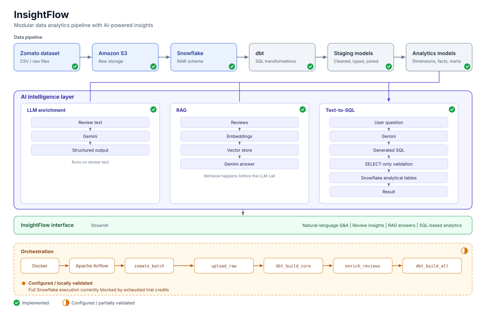
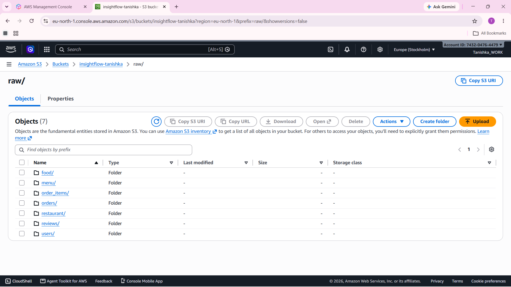
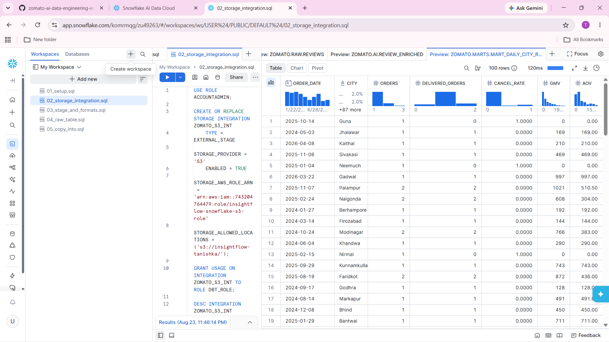
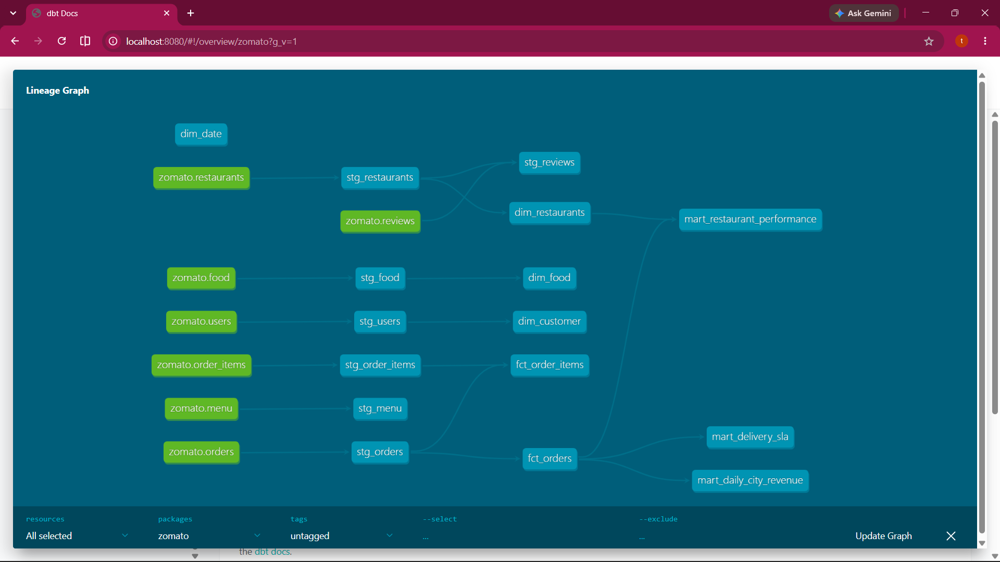
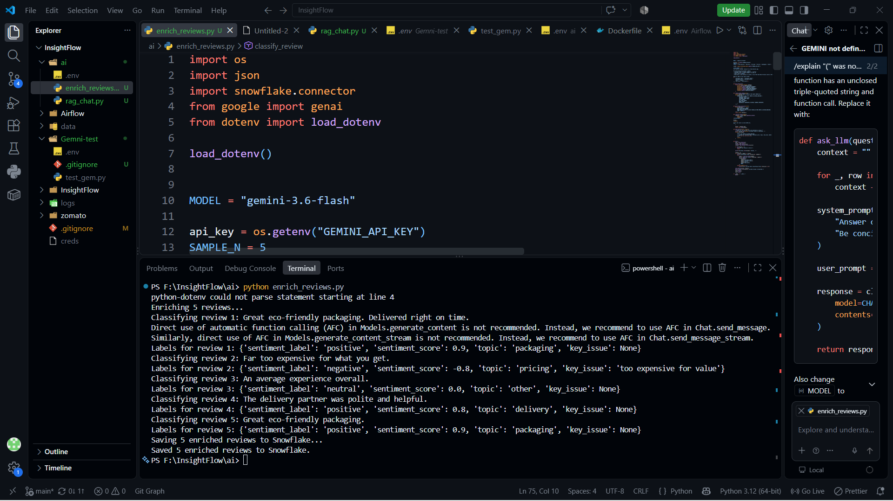
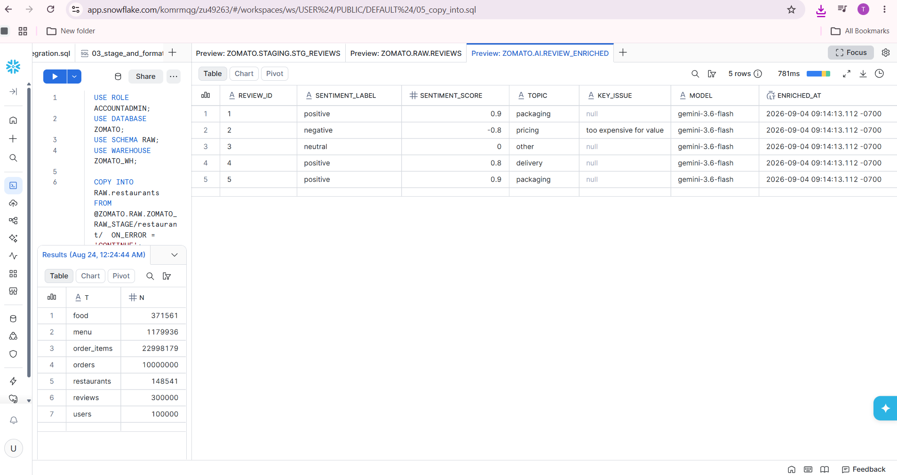
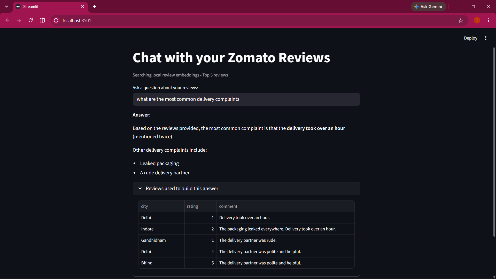
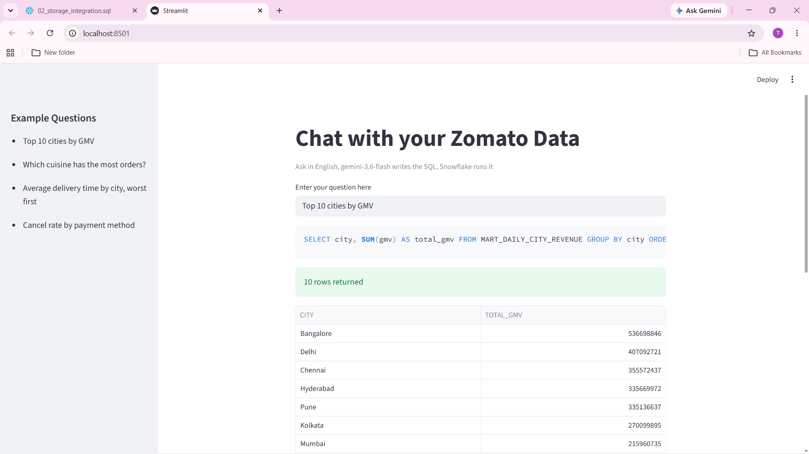

# InsightFlow

### Modular Data Analytics Pipeline with AI-Powered Insights

InsightFlow is a data analytics project that combines cloud storage, data warehousing, dbt transformations, and AI-powered analysis.

The project uses a Zomato dataset and takes the data through:

**S3 → Snowflake → dbt → Analytics → AI**

The AI layer adds three capabilities on top of the processed data:

- LLM-based review enrichment
- Retrieval-Augmented Generation (RAG)
- Natural Language to SQL

The project started from an end-to-end data engineering tutorial and was used as a hands-on implementation and learning project. I worked through the infrastructure, dbt models, Docker environment, AI components, and integration while adapting the project around my own setup.

---

## Architecture



The project is organized into four main layers:

```text
 DATA
  ↓
S3 → Snowflake RAW

TRANSFORMATION
  ↓
dbt → STAGING → FACTS / DIMENSIONS → MARTS

 AI
  ↓
LLM Enrichment
RAG
Text-to-SQL

INSIGHTS
  ↓
Natural-language questions
AI responses
Analytics results

```


## Dataset

The project uses the Zomato dataset provided with the original project reference.

The dataset is divided into 7 CSV datasets:

**Dimension Data**

1. Restaurants
2. Users
3. Food
4. Menu

**Fact / Activity Data**

1. Orders
2. Order Items
3. Reviews


| Dataset        | Approximate size |
|----------------|------------------|
| Orders         | 10 million       |
| Order Items    | 23 million       |
| Reviews        | 300,000          |
| Total CSV data | ~2.3 GB          |

The large CSV files are intentionally not stored in this GitHub repository.

They are downloaded separately and placed under the project's data/ directory before ingestion.

```text
data/
├── restaurants/
├── users/
├── food/
├── menu/
├── orders/
├── order_items/
└── reviews/

```

Data Pipeline

**1. Source → Amazon S3**

The raw CSV files are uploaded to Amazon S3.

The storage structure follows one folder per dataset, with S3 acting as the raw data storage layer.



**2. S3 → Snowflake**

Snowflake is used as the central analytical data warehouse.

The raw data is loaded into the RAW layer before dbt transformations are applied.

```text
Amazon S3
    ↓
Snowflake
    ↓
ZOMATO.RAW
```

The project separates raw, transformed, and analytical data into different schemas:

```text
ZOMATO
│
├── RAW
├── STAGING
├── MARTS
└── AI
```


**3. dbt Transformation Layer**

dbt handles the transformation of the raw Snowflake data.


The transformation flow is:
```text
RAW
  ↓
STAGING
  ↓
FACTS + DIMENSIONS
  ↓
BUSINESS MARTS
Staging
```

The staging layer cleans and standardizes the source data.

Examples include:

- Data type conversion
- Column renaming
- Cleaning restaurant values
- Handling missing values
- Email normalization
- Derived fields such as delivery status

***Dimensions***
The project contains analytical dimensions such as:

- `dim_restaurants`
- `dim_customer`
- `dim_food`
- `dim_date`

***Facts***
Transactional data is represented through fact models such as:

- `fct_orders`
- `fct_order_items`

***Business Marts***
The marts are designed around business questions rather than raw tables.

Examples:

- `mart_restaurant_performance`
- `mart_delivery_sla`
- `mart_daily_city_revenue`
- `mart_review_insights`

These models provide a cleaner layer for analytics and AI applications.

## 4. AI Layer

The AI layer is built on top of the transformed data. It currently contains three main capabilities.

**① LLM Enrichment**

The first capability uses an LLM as a transformation step.

Review text can be processed and converted into structured information such as:
Sentiment
Topic
Summarized information

The general flow is:
```text
Review
  ↓
LLM
  ↓
Structured JSON
  ↓
Enriched Review Data
  ↓
Analytics
```
This allows unstructured review text to become part of the analytical workflow.



**② RAG — Chat with Reviews**

The second capability is Retrieval-Augmented Generation (RAG).

Reviews are converted into embeddings and stored for similarity-based retrieval.

When a user asks a question:
```text
User Question
      ↓
  Embedding
      ↓
 Vector Search
      ↓
Relevant Reviews
      ↓
     LLM
      ↓
Grounded Answer
```
The system retrieves relevant review content before generating the answer.

This allows the response to be grounded in the actual review data rather than relying only on the LLM's general knowledge.


**③ Text-to-SQL**

The third capability allows users to ask questions about the analytical warehouse using natural language.

For example:

Which city generated the highest revenue?

The flow is:
```text
Natural Language
       ↓
      LLM
       ↓
      SQL
       ↓
SELECT-only validation
       ↓
   Snowflake
       ↓
     Result
```
The SQL generation is restricted to read-only queries before execution.
This allows users to explore analytical data without manually writing SQL.


**AI Layer at a Glance**
```text
                       AI LAYER
                           │
          ┌────────────────┼────────────────┐
          │                │                │
          ▼                ▼                ▼
   LLM Enrichment         RAG          Text-to-SQL
          │                │                │
          ▼                ▼                ▼
   Structured Data   Retrieved Data    SQL Query
          │                │                │
          └────────────────┼────────────────┘
                           ▼
                       Insights
```
The three capabilities solve different problems:

| Capability     | Purpose                                                   |
|----------------|-----------------------------------------------------------|
| LLM Enrichment | Convert unstructured reviews into structured information  |
| RAG            | Ask questions about review content                        |
| Text-to-SQL    | Ask questions about structured warehouse data             |


**Airflow Orchestration**
The Airflow environment has been configured and tested locally using Docker.

However, the complete scheduled workflow could not be fully executed against Snowflake because the available Snowflake trial/free-tier credits were exhausted during development.

## Tech Stack

| Category | Technologies |
|---|---|
| Cloud | Amazon S3, Snowflake |
| Data | Python, Pandas, SQL, dbt |
| Orchestration | Apache Airflow, Docker |
| AI | Gemini API, Embeddings, RAG, Text-to-SQL |
| Application | Streamlit |

##Limitations##
- Snowflake: The trial credits were exhausted, so the complete cloud pipeline cannot currently be run end-to-end.
- Dataset: ~2.3 GB of CSV data is kept outside GitHub.
- AI APIs: LLM features depend on API availability, quotas, and rate limits.
- Dataset-specific: The current dbt models and business logic are built around the Zomato dataset.
- Production: Additional work would be required for production monitoring, secret management, CI/CD, alerting, and AI evaluation.

## What I Learned

This project helped me understand how the different parts of a data stack connect rather than treating them as separate tools.

I worked with:

- S3 and cloud data storage
- Snowflake and analytical warehousing
- dbt transformations and data modelling
- Airflow and Docker
- LLM APIs and embeddings
- RAG
- Text-to-SQL

A major takeaway was that the quality of an AI application depends heavily on the data layer underneath it. Building the warehouse and transformation layer first made the AI components much more meaningful.

The project also involved quite a bit of debugging, especially around dbt paths, Snowflake configuration, Docker environments, credentials, and Airflow integration. That was an important part of the learning process.

## Future Improvements 

- Complete the Airflow pipeline with an active Snowflake environment
- Add automated data-quality monitoring
- Improve RAG evaluation
- Evaluate Text-to-SQL accuracy
- Add pipeline alerts and better observability
- Add CI/CD for dbt and Airflow
- Make the pipeline easier to adapt to other datasets


This project was developed while following the Zomato AI Data Engineering project by Darshil Parmar.

Tutorial:-

https://www.youtube.com/watch?v=kYwaNMQ3XT8

Original Repository:-

https://github.com/darshilparmar/zomato-ai-data-engineering-end-to-end-project

The original project was used as the starting reference for the dataset and overall data-engineering workflow. InsightFlow is my implementation and learning project around that workflow, including my environment setup, debugging, dbt work, Docker/Airflow setup, and AI experimentation.